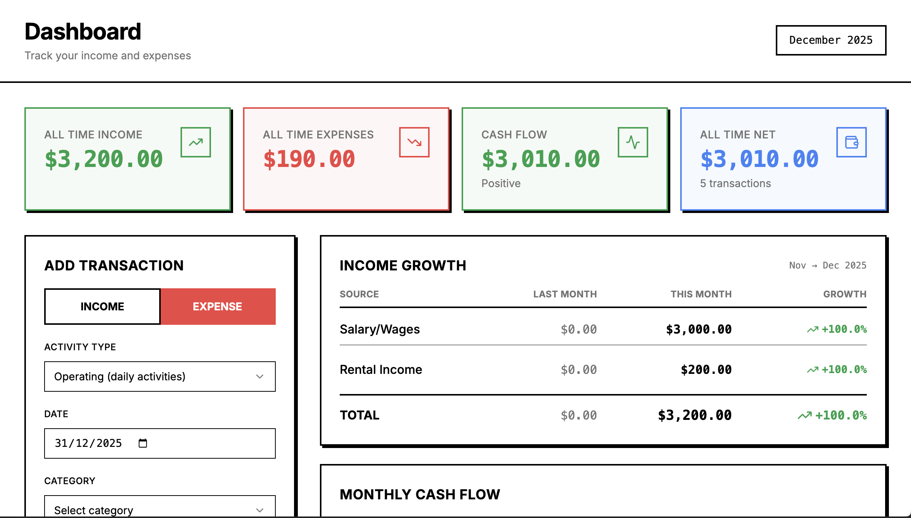
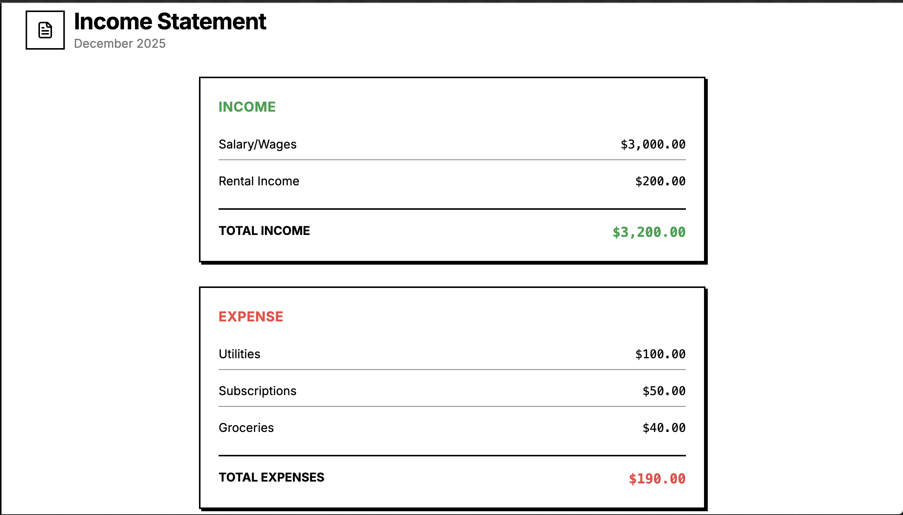
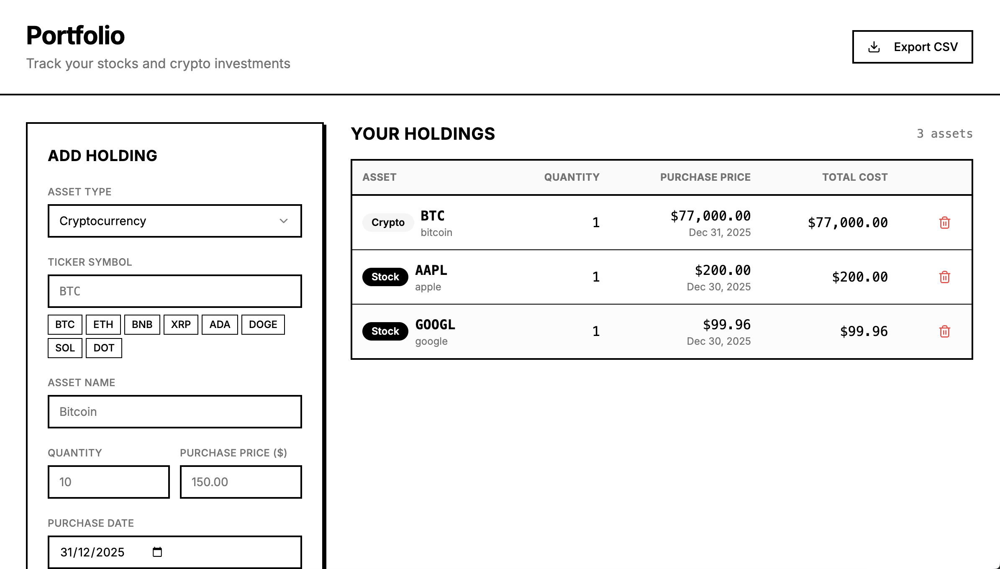
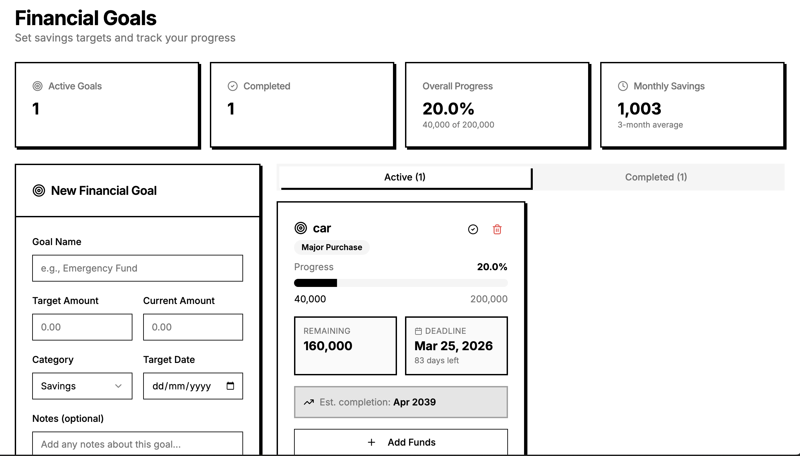
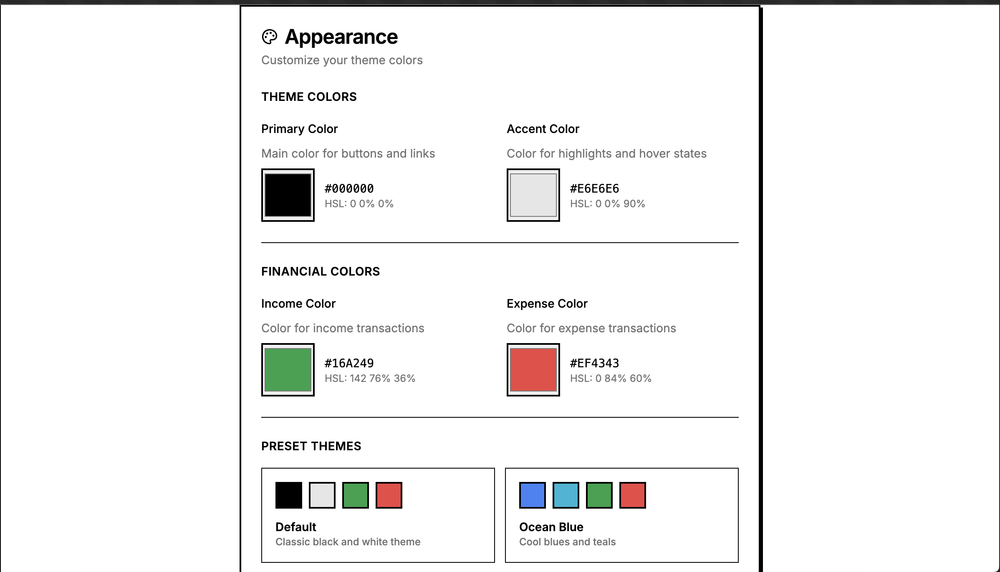

<div align="center">
  
  
  # FlowBase
  
  ### Personal Finance Tracker
  
  Track your finances, manage budgets, and monitor investments - all in one place.
  
  [](https://opensource.org/licenses/MIT)
  [](https://reactjs.org/)
  [](https://www.typescriptlang.org/)
  [](https://supabase.com/)
  
</div>

---

## 📸 Screenshots

<!-- PLACEHOLDER: Add your screenshots here -->

### Dashboard

*Your financial overview at a glance*

### Transactions

*Track all your income and expenses*

### Portfolio

*Monitor your investment holdings*

### Budget Tracking

*Set and track your spending limits*

### Theme Customization

*Customize your experience with multiple themes*

---

## ✨ Features

### 💰 Financial Management
- **Transaction Tracking** - Record income and expenses with detailed categories
- **Recurring Transactions** - Automate tracking of regular payments and income
- **Budget Management** - Set spending limits and track progress by category
- **Multi-Currency Support** - Track finances in multiple currencies

### 📊 Investment Tracking
- **Portfolio Management** - Track stocks and cryptocurrency holdings
- **Holdings Overview** - Monitor quantity, purchase price, and total cost
- **Export Functionality** - Download your portfolio data as CSV

### 📈 Financial Insights
- **Dashboard Analytics** - Visual overview of your financial health
- **Monthly Summaries** - Track income, expenses, and net balance
- **Spending Charts** - Visualize expenses by category
- **Cash Flow Analysis** - Monitor money in and money out

### 🎨 Customization
- **Theme Support** - Light, dark, and system themes
- **Color Customization** - Personalize with 5 preset themes or custom colors
- **Multi-Language** - Support for English, Arabic, Spanish, French, German, and Chinese
- **Responsive Design** - Works seamlessly on desktop, tablet, and mobile

### 🔒 Security & Privacy
- **Secure Authentication** - Email/password login with Supabase Auth
- **Row Level Security** - Your data is protected with RLS policies
- **Password Reset** - Secure password recovery flow
- **Data Privacy** - Your financial data stays private and secure

---

## 🚀 Tech Stack

- **Frontend**: React 18 + TypeScript
- **Styling**: Tailwind CSS + shadcn/ui components
- **Backend**: Supabase (PostgreSQL + Auth + Storage)
- **Build Tool**: Vite
- **Charts**: Recharts
- **Internationalization**: i18next
- **Deployment**: Vercel

---

## 🛠️ Getting Started

### Prerequisites

- Node.js 18+ and npm
- Supabase account ([sign up here](https://supabase.com))

### Installation

1. **Clone the repository**
   ```bash
   git clone https://github.com/xeropn/flowbase.git
   cd flowbase
   ```

2. **Install dependencies**
   ```bash
   npm install
   ```

3. **Set up environment variables**
   
   Create a `.env` file in the root directory:
   ```env
   VITE_SUPABASE_URL=your_supabase_project_url
   VITE_SUPABASE_ANON_KEY=your_supabase_anon_key
   ```

4. **Set up the database**
   
   Run the SQL schema in your Supabase project:
   ```bash
   # Copy the contents of database_schema.sql
   # Paste into Supabase SQL Editor and run
   ```

5. **Start the development server**
   ```bash
   npm run dev
   ```

6. **Open your browser**
   
   Navigate to `http://localhost:5173`

---

## 📁 Project Structure

```
flowbase/
├── public/              # Static assets
│   └── logo.png        # App logo
├── src/
│   ├── components/     # Reusable UI components
│   ├── hooks/          # Custom React hooks
│   ├── pages/          # Page components
│   ├── i18n/           # Internationalization
│   ├── integrations/   # Supabase integration
│   └── types/          # TypeScript types
├── supabase/           # Supabase configuration
├── database_schema.sql # Database schema
└── README.md
```

---

## 🌐 Deployment

### Deploy to Vercel

[](https://vercel.com/new/clone?repository-url=https://github.com/YOUR_USERNAME/flowbase)

1. Click the button above
2. Add environment variables:
   - `VITE_SUPABASE_URL`
   - `VITE_SUPABASE_ANON_KEY`
3. Deploy!

### Manual Deployment

```bash
# Build for production
npm run build

# Preview production build
npm run preview
```

See [deployment_checklist.md](./deployment_checklist.md) for detailed deployment instructions.

---

## 🤝 Contributing

Contributions are welcome! Please feel free to submit a Pull Request.

1. Fork the repository
2. Create your feature branch (`git checkout -b feature/AmazingFeature`)
3. Commit your changes (`git commit -m 'Add some AmazingFeature'`)
4. Push to the branch (`git push origin feature/AmazingFeature`)
5. Open a Pull Request

---

## 📝 License

This project is licensed under the MIT License - see the [LICENSE](LICENSE) file for details.

---

## 🙏 Acknowledgments

- Built with [React](https://reactjs.org/)
- UI components from [shadcn/ui](https://ui.shadcn.com/)
- Icons from [Lucide](https://lucide.dev/)
- Backend powered by [Supabase](https://supabase.com/)
- Deployed on [Vercel](https://vercel.com/)

---

## 📧 Contact

For questions or support, please open an issue on GitHub.

---

<div align="center">
  Made with ❤️ by the FlowBase team
  
  ⭐ Star this repo if you find it helpful!
</div>
